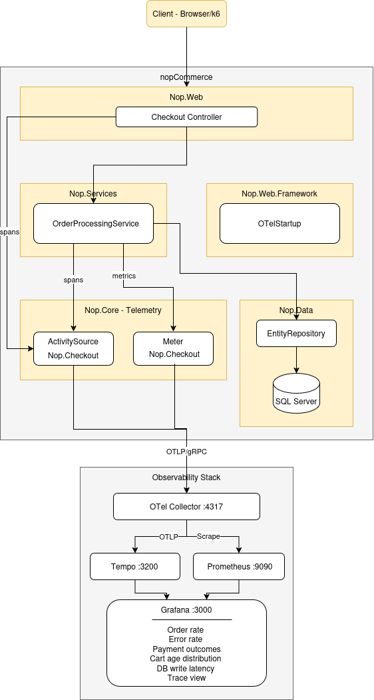

# nopCommerce + OpenTelemetry

**Flow instrumented:** Customer places an order — Basket → Order → Payment → Inventory


## Architecture Diagram



## How to Build and Run

### Prerequisites

- Docker and Docker Compose
- k6

### Start
On root of the repository, run:

```bash
docker compose up --build -d
```

| Service | URL |
|---------|-----|
| nopCommerce | http://localhost |
| Grafana | http://localhost:3000 (admin / admin) |
| Prometheus | http://localhost:9090 |
| Tempo | http://localhost:3200 |

### First-run setup

1. Open http://localhost and complete the installation wizard:
   - Server name: `nopcommerce_mssql_server`
   - Database name: `nopcommerce` (or leave default)
   - SQL Username: `sa`
   - SQL Password: `nopCommerce_db_password`
   - Create sample data: **checked**
   - Create database if it doesn't exist: **checked**
2. After "restart" (website just goes down):
    ```bash
    docker compose up
    ```

---

## View the Dashboard

Open http://localhost:3000 → Dashboards → **nopCommerce Checkout Flow**.

To generate traffic, run the load test:

```bash
k6 run load-tests/checkout.js
```
> Default: 1 human VUs + 1 bot VUs for 5 minutes.


